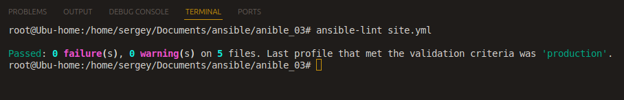
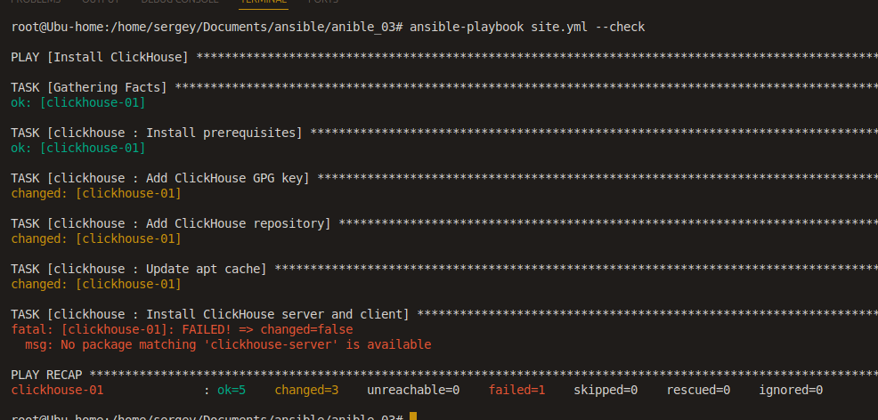
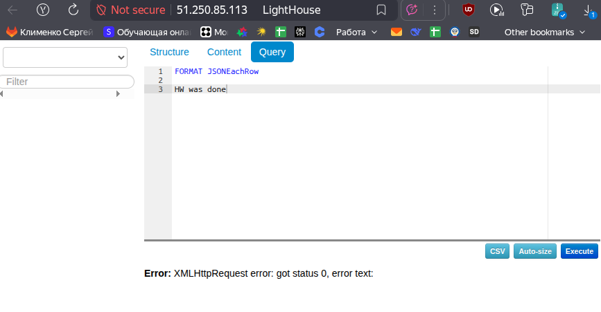

# Ansible Playbook для установки ClickHouse, Vector и Lighthouse

Этот проект содержит Ansible playbooks для автоматической установки и настройки трех компонентов на отдельных хостах в Yandex Cloud:
- **ClickHouse** - колоночная СУБД
- **Vector** - система сбора и обработки логов
- **Lighthouse** - инструмент для анализа производительности веб-приложений

## Структура проекта

```
.
├── terraform/                  # Terraform конфигурация для создания инфраструктуры
│   ├── main.tf                # Основная конфигурация
│   ├── outputs.tf             # Переменные
│   ├── providers.tf           # Провайдер
│   ├── terraform.auto.tfvars  # Чувствительные переменные
│   └── variables.tf           # Переменные
├── roles/
│   ├── clickhouse/        # Роль для установки ClickHouse
│   │   └── tasks/main.yml
│   ├── vector/            # Роль для установки Vector
│   │   └── tasks/main.yml
│   └── lighthouse/        # Роль для установки Lighthouse
│       ├── tasks/main.yml
│       ├── templates/nginx.conf.j2
│       └── handlers/main.yml
├── site.yml               # Главный playbook
├── prod.yml               # Inventory файл
├── ansible.cfg            # Конфигурация Ansible
└── README.md              # Этот файл
```

## Требования

- Terraform >= 0.13
- Ansible >= 2.9
- Yandex Cloud аккаунт с настроенным провайдером
- SSH ключ для доступа к виртуальным машинам

## Использование

### 1. Создание инфраструктуры с помощью Terraform

```bash
cd terraform
terraform init
terraform plan
terraform apply
```

После применения Terraform мы получаем IP-адреса созданных виртуальных машин. Подставляем в inventory файл `prod.yml` IP-адреса.

### 2. Настройка inventory файла

Редактируем файл `prod.yml`:

```yaml
clickhouse:
  hosts:
    clickhouse-01:
      ansible_host: 178.154.202.214
      ansible_user: ubuntu

vector:
  hosts:
    vector-01:
      ansible_host: 89.169.149.190
      ansible_user: ubuntu

lighthouse:
  hosts:
    lighthouse-01:
      ansible_host: 51.250.85.113
      ansible_user: ubuntu
```

### 3. Проверка playbook с помощью ansible-lint

Выполняем проверку:

```bash
ansible-lint site.yml
```


### 4. Тестовый запуск (dry-run)

```bash
ansible-playbook site.yml --check
```

Из-за флага --check возникает ошибка, т.к. в режиме --check репозитории обновляются, но операция установки пакета не выполняется на самом деле, и потому пакет не найден/доступен

### 5. Применение playbook с отображением изменений

```bash
ansible-playbook site.yml --diff
```

### 6. Проверка идемпотентности

Повторно запускаю playbook с флагом `--diff`:

```bash
ansible-playbook site.yml --diff
```

Если playbook идемпотентен, вы не увидите изменений при повторном запуске.

## Параметры

Playbook не требует дополнительных параметров. Все настройки выполняются автоматически.

## Теги

Можно запустить отдельные роли используя теги:

- `clickhouse` - установка только ClickHouse
- `vector` - установка только Vector
- `lighthouse` - установка только Lighthouse

Пример использования:

```bash
ansible-playbook site.yml --tags clickhouse
ansible-playbook site.yml --tags vector
ansible-playbook site.yml --tags lighthouse
```

## Что делает playbook

### ClickHouse
- Добавляет официальный репозиторий ClickHouse
- Устанавливает ClickHouse server
- Запускает и включает сервис ClickHouse

### Vector
- Добавляет официальный репозиторий Vector
- Устанавливает Vector
- Запускает и включает сервис Vector

### Lighthouse
- Устанавливает Nginx веб-сервер
- Скачивает статические файлы Lighthouse с GitHub
- Распаковывает файлы в `/var/www/lighthouse`
- Настраивает Nginx для обслуживания Lighthouse
- Запускает и включает сервис Nginx

После установки Lighthouse будет доступен по IP-адресу хоста на порту 80.


## Модули Ansible

Playbook использует следующие модули:
- `get_url` - для скачивания файлов
- `template` - для создания конфигурационных файлов
- `apt` - для установки пакетов (Ubuntu/Debian)
- `systemd` - для управления сервисами
- `file` - для работы с файлами и директориями
- `unarchive` - для распаковки архивов

## Примечания

- Все роли требуют прав суперпользователя (become: true)
- Playbook предназначен для Ubuntu 22.04 LTS
- Для других дистрибутивов может потребоваться адаптация (использование `yum` вместо `apt`)

